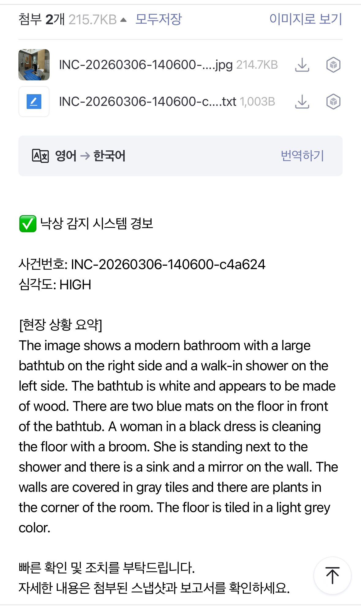
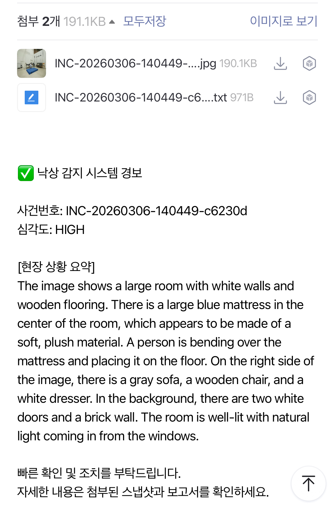

# 🚨 Agentic AI 다중 구역 낙상 감지 시스템 (Multi-Zone Fall Detection)

단순한 객체 인식을 넘어, **YOLOv8** (Pose)과 **Florence-2** (Vision-Language Model)를 **LangGraph** 기반의 에이전틱(Agentic) 워크플로우로 묶어낸 엔터프라이즈급 실시간 관제 시스템입니다.


---

## 📌 주요 개발 내용 및 성과 (What I Did & Results)

### 1. 🤖 하드코딩 탈피: Agentic Workflow 설계 (LangGraph)
- **What I Did:** 단순히 "사람이 넘어졌다 -> 알람 울림" 형태의 정적인 룰(Rule-based)이 아닌, 프레임을 인식하고(`PerceptionNode`), 맥락을 분석하며(`VLMNode`), 어떻게 대응할지 결정하여(`DecisionNode`) 실제 조치(`ActionNode`)를 내리기까지의 파이프라인을 LangGraph 기반 에이전트로 구현했습니다.
- **Result:** 노인 병동, 계단, 거실 등 장소의 특성이나 상황(위험물 유무 등)에 따라 심각도(Severity) 점수를 다르게 계산하여 **가짜 알람(False Positive)은 줄이고 위급 상황의 정확도는 획기적으로 상승**시켰습니다.

### 2. 🎥 다중 카메라 동시 스트리밍 아키텍처 구현 (FastAPI Async)
- **What I Did:** 거실과 복도(Zone 1, Zone 2) 등 각기 다른 장소의 영상 피드를 동시에 처리하기 위해, 백엔드에서 무거운 추론 모델(YOLO)이 FastAPI의 비동기(asyncio) 이벤트 루프를 블로킹하지 않도록 `run_in_executor`를 활용한 멀티스레딩 스트리밍(MJPEG) 환경을 구축했습니다.
- **Result:** 여러 대의 CCTV 영상이 서버 병목 없이 약 **24 FPS**의 부드러운 화질로 프론트엔드 대시보드에 끊김 없이 안전하게 양방향 송출됩니다.

### 3. 🤔 포즈 추정(Pose Estimation) 휴리스틱 알고리즘 튜닝
- **What I Did:** 사용자가 물건을 줍기 위해 빠르게 쪼그려 앉는 행위(Squatting)를 낙상으로 오인하는 고질적인 문제를 해결하기 위해, 신체 기울기(Angle) 임계치를 45도로 상향하고 즉발성 임계치를 제거하여 정확히 0.75초(15프레임) 이상 바닥에 평행한 상태를 유지할 때만 낙상으로 판정하도록 로직을 정교화했습니다.
- **Result:** 일상적인 빠른 움직임과 실제 낙상(Fall)을 완벽히 구분해내는 견고한 탐지 성능을 확보했습니다.

### 4. 🖥️ 관제실 특화 UI/UX 대시보드 개발 (Next.js)
- **What I Did:** 터미널과 사이버펑크 감성을 결합한 다크 모드 기반의 실시간 모니터링 웹 대시보드를 Next.js와 TailwindCSS로 개발했습니다. 백엔드 SQLite 데이터베이스와 2초 주기로 폴링(Polling)하여 통계를 갱신합니다.
- **Result:** 낙상 발생 시 즉각적으로 경고음과 함께 화면이 붉은색 맥박(Pulse) 형태로 점멸하며, 영상 중앙에 **'출동 요원 배치(Mock Dispatch)'** 타이포그래피가 출력되는 등 **압도적이고 몰입감 있는 실무형 관제 시스템**을 완성했습니다.

### 5. 📧 실시간 자동 긴급 이메일 발송 (Auto Email Alert)
- **What I Did:** 보안 담당자가 자리를 비운 최악의 상황을 대비하여, 낙상(`HIGH` severity) 발생 즉시 해당 프레임을 캡처하고 Florence-2 VLM이 진단한 상세 분석 보고서(TXT)를 첨부하여 G메일 SMTP 서버를 통해 담당자 스마트폰으로 긴급 전송하는 로직을 구현했습니다.
- **Result:** 언제 어디서든 스마트폰을 통해 실제 환자가 쓰러진 사진과 상황 보고서를 즉시 확인할 수 있는 **오프라인 연계형 2중 안전 장치**를 마련했습니다.

> **💡 구동 화면 및 이메일 수신 인증샷**
> 
> <div align="center">
>   
>   
> </div>
> 
> *(첨부된 이메일에는 Florence-2 스냅샷과 낙상 당시 상황 보고서가 함께 전송됩니다.)*

---

## 🛠 기술 스택 (Tech Stack)
- **AI / Agent Logic:** LangGraph, Ultralytics YOLOv8-pose, Transformers (Florence-2)
- **Backend:** Python, FastAPI, Uvicorn, SQLite
- **Frontend:** Next.js (React), TailwindCSS, Lucide Icons

---

## 🚀 실행 방법 (Setup)

### 1. 사전 준비 (Prerequisites)
- Python 3.10 이상
- Node.js & npm

### 2. 백엔드 설치 및 실행 (Backend)
```bash
# 1. 가상환경 생성 및 필요 라이브러리 설치
python -m venv .venv
source .venv/bin/activate
pip install -r requirements.txt

# 2. FastAPI 서버 실행
uvicorn api.main:app --port 8000 --reload
```

### 3. 프론트엔드 설치 및 실행 (Frontend)
새로운 터미널 창을 열고 아래 명령어를 실행합니다.
```bash
# 1. 패키지 설치
cd frontend
npm install

# 2. 개발 서버 실행
npm run dev
```

브라우저를 열고 `http://localhost:3000` 에 접속하면 다중 구역 낙상 관제 대시보드를 확인할 수 있습니다.
