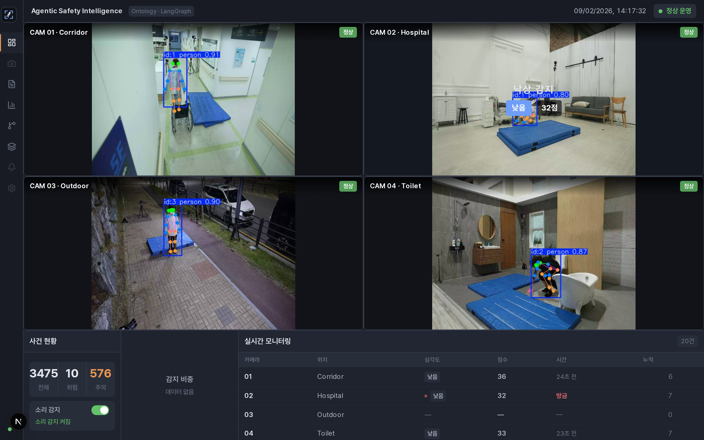
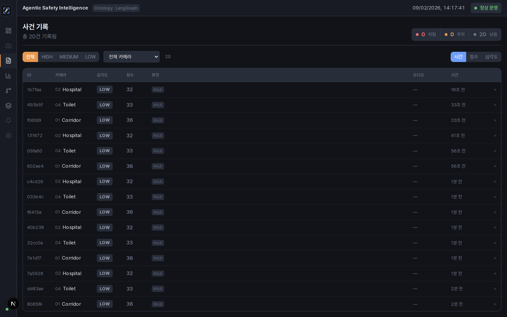
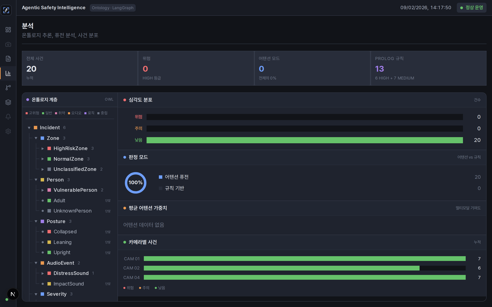
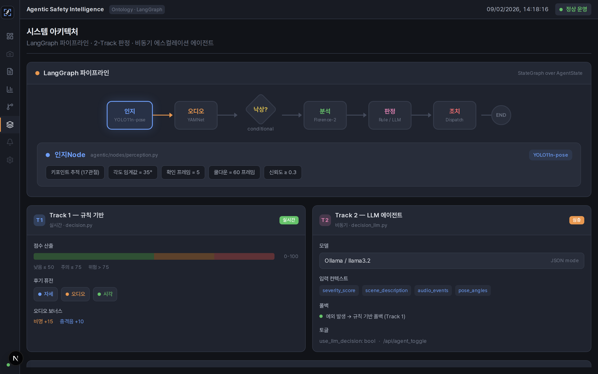
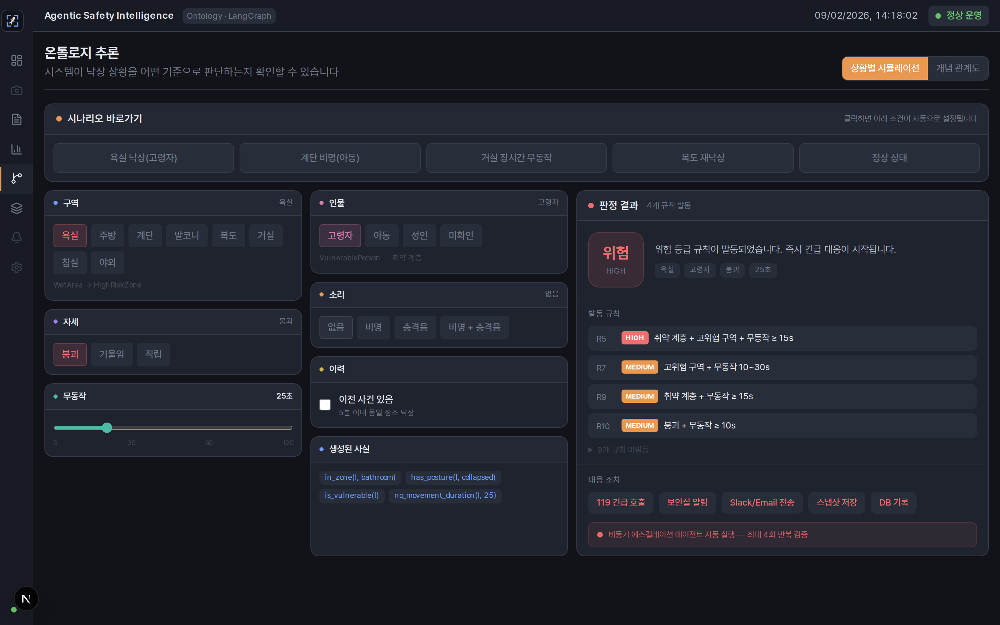
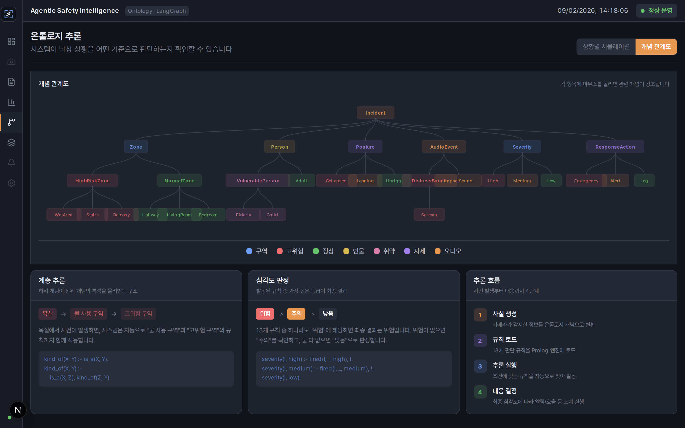
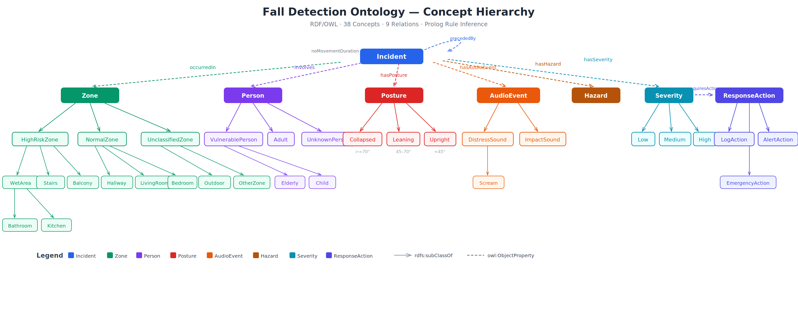

<div align="center">

# Agentic AI 낙상 감지 시스템
### Multi-Zone Real-Time Fall Detection with Agentic Workflow

<br/>

[-6366f1?style=for-the-badge&logo=data:image/svg+xml;base64,PHN2ZyB4bWxucz0iaHR0cDovL3d3dy53My5vcmcvMjAwMC9zdmciIHZpZXdCb3g9IjAgMCAyNCAyNCI+PHBhdGggZmlsbD0id2hpdGUiIGQ9Ik0xMiAyQzYuNDggMiAyIDYuNDggMiAxMnM0LjQ4IDEwIDEwIDEwIDEwLTQuNDggMTAtMTBTMTcuNTIgMiAxMiAyek0xMSAxN3YtNkg5bDMtNCAzIDRoLTJ2NmgtMnoiLz48L3N2Zz4=)](https://github.com/yhlee/Agentic-fall-detection-system)
[](https://fastapi.tiangolo.com/)
[](https://nextjs.org/)
[](https://ultralytics.com/)
[](https://huggingface.co/microsoft/Florence-2-large)
[](https://python.org)

<br/>

> 멀티모달 후기 융합(영상·음성·VLM)과 온톨로지 규칙 추론으로<br/>판단 근거까지 반환하는 **2-Track 실시간 낙상 관제 시스템**

</div>

---

## 시스템 구동 화면

<div align="center">
  
  <br/>
  <sub><b>다중 구역(Multi-Zone) 모니터링 관제 대시보드</b><br/>복도·병실·야외·화장실 4개 CCTV를 실시간 관제하는 Grafana 스타일 통합 대시보드</sub>
</div>

### 웹 대시보드

<table>
  <tr>
    <td align="center" width="50%">
      <br/>
      <sub><b>실시간 관제 대시보드</b> — 4개 카메라 동시 모니터링, 사건 현황, 실시간 모니터링 테이블</sub>
    </td>
    <td align="center" width="50%">
      <br/>
      <sub><b>사건 기록</b> — 심각도·카메라·시간순 필터링, 판정 모드·오디오 정보 포함</sub>
    </td>
  </tr>
  <tr>
    <td align="center">
      <br/>
      <sub><b>분석</b> — OWL 온톨로지 계층 트리 + 심각도 분포·판정 모드·카메라별 사건 차트</sub>
    </td>
    <td align="center">
      <br/>
      <sub><b>시스템 아키텍처</b> — LangGraph 파이프라인 시각화, 2-Track 판정 구조</sub>
    </td>
  </tr>
  <tr>
    <td align="center">
      <br/>
      <sub><b>온톨로지 시뮬레이터</b> — 구역·인물·자세·소리 조건을 조합해 Prolog 규칙 발동 결과 확인</sub>
    </td>
    <td align="center">
      <br/>
      <sub><b>개념 관계도</b> — RDF/OWL 온톨로지의 38개 개념·9개 관계를 계층 트리로 시각화</sub>
    </td>
  </tr>
</table>

---

## 무엇을 만들었나

CCTV 영상과 오디오로 낙상을 감지하고, 심각도를 판정해 대응까지 자동화하는
실시간 관제 시스템이다. LangGraph 파이프라인(지각 → 분석 → 판단 → 행동) 위에
**2-Track 구조**를 얹었다. 실시간 경로가 밀리초 단위로 판정해 즉시 내부 알림을
보내고, 비동기 경로의 LLM Agent가 그 뒤에 119 신고 여부 같은 무거운 판단을
맡는다.

판정 경로는 네 가지이며 실행 시 선택한다. 그중 **온톨로지 모드**는 RDF/OWL 개념
계층과 Prolog 규칙으로 판정하고, **발동한 규칙 ID를 판단 근거로 함께 반환한다.**

## 시스템 아키텍처

```
┌──────────────────────────────────────────────────────────────────────────┐
│  Track 1 — 실시간 경로 (조건 분기 파이프라인)                             │
│                                                                          │
│   CCTV        Audio                                                      │
│     │           │                                                        │
│     ▼           ▼                                                        │
│  Perception → Audio ──▶ fall_detected?                                   │
│  (YOLO11n)   (YAMNet)    ├─ No  ─▶ END                                   │
│                          └─ Yes ─▶ Analysis ─▶ Decision ─▶ Action        │
│                                    (Florence-2)    │        (DB/알림)    │
│                                                    │            │        │
│                        ┌───────────────────────────┘            │        │
│                        │  판정 경로 4가지 (--decision-mode)      │        │
│                        ├─ rule       휴리스틱 점수 0~100         │        │
│                        ├─ attention  Multi-Head Self-Attention   │        │
│                        ├─ llm        Ollama 프롬프트 판단        │        │
│                        └─ ontology   RDF/OWL + Prolog 규칙 추론  │        │
│                                      → 발동 규칙 ID 반환         │        │
└──────────────────────────────────────────────────────────────────│───────┘
                                                                   │
                                        낙상 감지 시 dispatch (별도 스레드)
                                                                   ▼
┌──────────────────────────────────────────────────────────────────────────┐
│  Track 2 — 비동기 경로 (LangGraph ReAct Agent, max 4회 / 30s)             │
│                                                                          │
│   EscalationAgent ── reason(Ollama) ⇄ act(도구 4종) ── 119 신고 판단      │
│                                                                          │
│   Track 1의 발동 규칙을 입력으로 받아 "왜 HIGH인지" 아는 상태로 시작한다. │
└──────────────────────────────────────────────────────────────────────────┘
```

설계 근거와 각 노드의 상세는 **[ARCHITECTURE.md](docs/ARCHITECTURE.md)** 참고.

### 온톨로지 개념 관계도

<div align="center">
  
  <br/>
  <sub><b>RDF/OWL 온톨로지 계층</b> — 38개 개념 · 9개 관계 · Prolog 규칙이 이 계층을 따라 <code>is_a/2</code>로 추론한다</sub>
</div>

## 빠른 시작

```bash
# 1) 시스템 패키지 (온톨로지 모드에 필요 — 없으면 룰 기반으로 폴백)
sudo apt-get install -y swi-prolog-nox

# 2) 백엔드
python3 -m venv .venv && source .venv/bin/activate
pip install -r requirements.txt
python -m uvicorn api.main:app --port 8000 --reload

# 3) 프론트엔드
cd frontend && npm install && npm run dev      # localhost:3000
```

영상 파일 하나를 CLI로 처리하려면:

```bash
python main_agentic.py --video input/sample.mp4 --decision-mode ontology
```

## 판정 모드 4가지

| | 방식 | 판단 근거 | 재현성 |
|---|---|---|---|
| `rule` | 휴리스틱 점수 가산 | 없음 (점수만) | 난수로 흔들림 |
| `attention` | Self-Attention 융합 | 모달리티 가중치 | 있음 |
| `llm` | Ollama 프롬프트 | 자연어 (사후 생성) | 없음 |
| **`ontology`** | **Prolog 규칙 추론** | **발동 규칙 ID** | **있음 (조건부)** |

같은 입력 10개 시나리오를 네 경로로 돌린 결과에서 확인된 것들이다.

- **무동작 300초와 8초가 `rule` 모드에서 같은 판정을 받는다** — 무동작 지속
  시간이 점수식에 쓰이지 않는다(`decision.py:78`)
- **경계값에서 `rule` 모드의 판정이 실행마다 갈린다** — 점수에 난수가 섞여
  있다(`decision.py:91`)
- **`llm` 모드는 30회 호출 전부 MEDIUM을 반환했다** — 입력과 무관하게 같은 답
- **3일 내 재낙상 판정은 `ontology` 모드만 가능하다** — 나머지 셋은 현재
  프레임만 보므로 이력이라는 개념이 없다

```
S8 (복도 12초 무동작)   이력 없음 → LOW
                        3일 내 재낙상 → HIGH
                        r6 (동일 구역 재낙상 + 무동작 10초 이상)
                        r13 (동일 구역 재낙상)
```

`decision.py`는 비교 대조군이므로 위 결함을 의도적으로 고치지 않았다. 실험
전문(10개 시나리오 표, 규칙 16개, Prolog 연동 상세)은
**[ONTOLOGY.md](docs/ONTOLOGY.md)** 참고.

```bash
python -m scripts.compare_modes      # 비교 실험 재실행 (임시 DB 사용)
```

## 왜 온톨로지인가

### 네 가지 접근의 위치

네 모드는 진화 라인이 아니라, 같은 문제에 대한 **서로 다른 접근**이다.

```
rule ──(학습으로 개선)──▶ attention     "현재 프레임 → 점수" 구조
                                        설명 불가, 이력 불가

llm  ──(자연어 판단)──                  설명은 하지만 사후 합리화, 이력 불가

ontology ──(기호 추론)──                 설명 가능 + 이력 반영 + 재현성
```

- `rule`은 대조군(baseline)이다. `attention`은 같은 구조에서 융합만 학습으로 개선한 것이다.
- `llm`은 자연어로 판단 근거를 생성하지만, **사후 합리화(post-hoc rationalization)**
  문제가 있다. 판정을 먼저 내리고 이유를 나중에 만들어내므로 "이 이유로 이 판정을 한
  것인지" 보장할 수 없다.
- `ontology`는 반대다. **규칙이 발동했기 때문에 판정이 나온 것**이므로 인과 관계가 명확하다.

### Neuro-Symbolic 구조

이 프로젝트의 아키텍처는 Neuro-Symbolic AI에 해당한다.

```
[Neural — 지각]                          [Symbolic — 판단]

YOLO11n   → "사람이 쓰러졌다" (포즈)  ─┐
YAMNet    → "비명이 들렸다" (소리)    ─┤→  Prolog 규칙 추론 → "HIGH, R5 발동"
Florence-2 → "욕실에 노인이 있다" (맥락) ─┘
```

신경망(YOLO, YAMNet, Florence-2)이 지각을 담당하고, 기호 추론(RDF/OWL + Prolog)이
판단을 담당한다. Florence-2는 판단을 하지 않는다 — 장면 캡셔닝 한 줄을 뽑아서 판단
노드에 **맥락 정보**로 전달하는 역할이다.

### 온톨로지 모드만 할 수 있는 것

| 시나리오 | rule / attention / llm | ontology |
|---|---|---|
| "왜 HIGH인가?" | 점수, weight, 자연어 | **R5 발동 (조건 명시)** |
| 같은 장소 3일 내 재낙상 | 판별 불가 (현재 프레임만) | **r6, r13 발동** |
| 새 구역 추가 (수영장) | 코드 수정 / 재학습 / 프롬프트 수정 | **TTL에 한 줄 추가** |
| 규칙 감사 | 코드를 읽어야 함 | **rules.pl 16개 열거** |

## 기술 스택

| 분류 | 기술 |
|---|---|
| **AI / Agent** | LangGraph, YOLO11n-pose, Florence-2, YAMNet, Ollama, PyTorch |
| **온톨로지 / 기호 추론** | SWI-Prolog 9.0, pyswip, RDF/OWL + rdflib, Turtle |
| **Backend** | Python 3.12, FastAPI, Uvicorn, SQLite |
| **Frontend** | Next.js (React), TailwindCSS |
| **알림** | Gmail SMTP, Slack Webhook |

## 프로젝트 구조

<details>
<summary>디렉터리 트리 (펼치기)</summary>

```
agentic/
├── graph.py                  # LangGraph 워크플로우 + 판정 모드 4-way 분기
├── state.py                  # AgentState 스키마
├── nodes/
│   ├── perception.py         # YOLO11n 포즈 추정
│   ├── audio.py              # YAMNet 오디오 분류
│   ├── analysis.py           # Florence-2 VLM 분석
│   ├── decision.py           # 룰 / Attention 판정  (비교 대조군, 무변경)
│   ├── decision_llm.py       # LLM 판정 (Ollama)
│   ├── decision_ontology.py  # 온톨로지 + Prolog 판정
│   └── action.py             # DB / 스냅샷 / 알림 / Agent 디스패치
├── ontology/                 # ── 온톨로지 기반 설명가능 판정
│   ├── ontology.ttl          #    RDF/OWL 정본 (개념 38 · 관계 9)
│   ├── schema.py             #    ttl → Prolog is_a/2 변환 + 순환 검증
│   ├── facts.py              #    AgentState → Prolog 사실 (순수 함수)
│   ├── history.py            #    사건 이력 → 시간축 사실
│   ├── rules.pl              #    판정 규칙 16개
│   ├── engine.py             #    pyswip 엔진 · 전역 Lock · 사실 격리
│   └── visualize.py          #    ttl → Mermaid 다이어그램
├── fusion/                   # Attention 멀티모달 융합 (학습/추론)
├── agent/                    # 비동기 에스컬레이션 Agent (ReAct)
├── audio/                    # 오디오 청크 추출 / 라벨 매핑
└── tools/                    # DB · 이메일 · Slack · 리포트

api/main.py                   # FastAPI + MJPEG 스트리밍
frontend/                     # Next.js 관제 대시보드
scripts/compare_modes.py      # 판정 모드 4종 비교 실험
tests/                        # pytest (144개)
```

</details>

## 데이터셋

테스트 입력 영상은 **AI Hub**의 「낙상사고 위험동작 영상-센서 쌍 데이터」를 사용했다.
용량·라이선스 문제로 저장소에는 포함하지 않는다.

## 문서

| 문서 | 내용 |
|---|---|
| **[ARCHITECTURE.md](docs/ARCHITECTURE.md)** | 2-Track 설계 근거, 왜 전부 Agent로 만들지 않았는가 |
| **[ONTOLOGY.md](docs/ONTOLOGY.md)** | 온톨로지 · Prolog 판정 전체 (규칙 16개, 비교 실험, 연동 상세) |
| **[DEVELOPMENT.md](docs/DEVELOPMENT.md)** | 개발 항목별 상세 (Agentic Workflow, 멀티모달 융합, 대시보드 등) |

## 향후 발전 방향

- **Multi-Agent 오케스트레이터** — 단일 EscalationAgent를 HistoryAgent /
  SituationAgent / DecisionAgent로 분리, LangGraph fan-out → fan-in 병렬 실행
- **track_id 기반 사건 동일성 판별** — 현재는 재검출과 재낙상을 시간 간격(5분)으로
  구분한다. 동일 인물의 연속 이벤트를 묶으면 이 하한이 불필요해진다
- **온톨로지 일관성 검증** — `owl:disjointWith` 선언과 위반 검사 추가
- **Persistent Memory** — 인시던트 이력을 Agent 판단에 자동 반영
