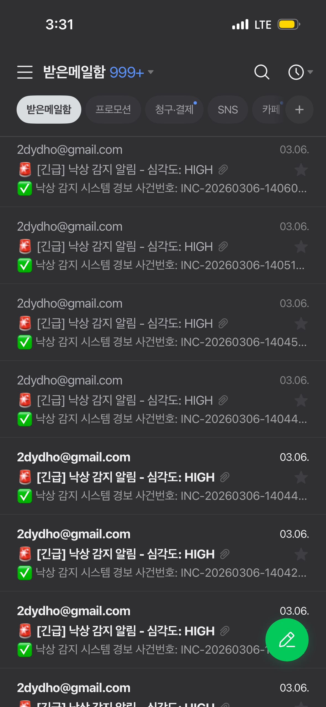
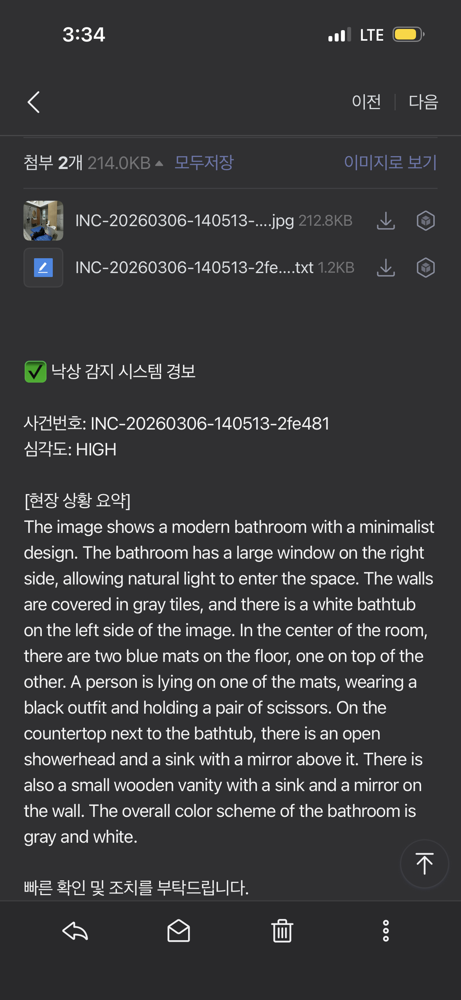
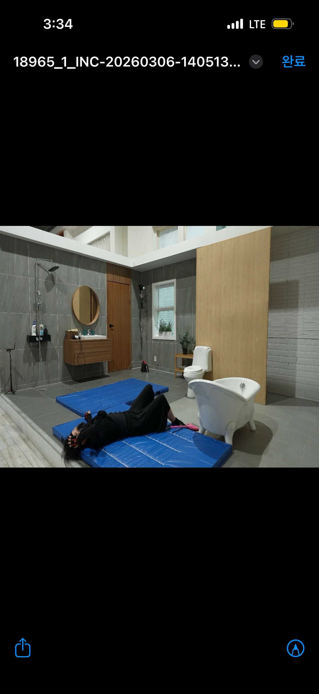
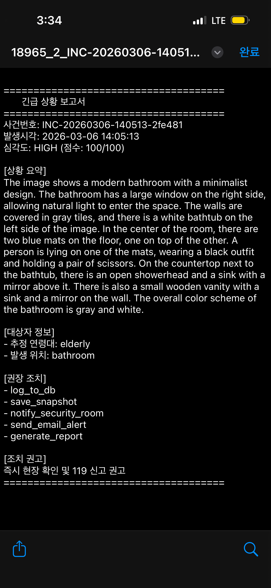
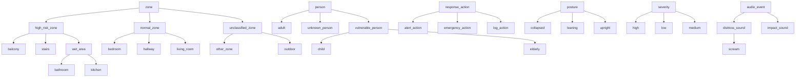

<div align="center">

# Agentic AI 낙상 감지 시스템
### Multi-Zone Real-Time Fall Detection with Agentic Workflow

<br/>

[-6366f1?style=for-the-badge&logo=data:image/svg+xml;base64,PHN2ZyB4bWxucz0iaHR0cDovL3d3dy53My5vcmcvMjAwMC9zdmciIHZpZXdCb3g9IjAgMCAyNCAyNCI+PHBhdGggZmlsbD0id2hpdGUiIGQ9Ik0xMiAyQzYuNDggMiAyIDYuNDggMiAxMnM0LjQ4IDEwIDEwIDEwIDEwLTQuNDggMTAtMTBTMTcuNTIgMiAxMiAyek0xMSAxN3YtNkg5bDMtNCAzIDRoLTJ2NmgtMnoiLz48L3N2Zz4=)](https://github.com/yhlee/Agentic-fall-detection-system)
[](https://fastapi.tiangolo.com/)
[](https://nextjs.org/)
[](https://ultralytics.com/)
[](https://huggingface.co/microsoft/Florence-2-large)
[](https://python.org)

<br/>

> 단순한 룰 기반 탐지를 넘어, **지각(Perceive) → 분석(Analyze) → 판단(Decide) → 행동(Act)** 의 자율적 사이클로 동작하는 엔터프라이즈급 실시간 낙상 관제 시스템

</div>

---

## 시스템 구동 화면

<div align="center">
  
  <br/>
  <sub><b>다중 구역(Multi-Zone) 모니터링 관제 대시보드</b><br/>복도·병실·야외·화장실 4개 CCTV를 실시간 관제하는 Grafana 스타일 통합 대시보드</sub>
</div>

---

## 시스템 아키텍처

```
┌──────────────────────────────────────────────────────────────────────┐
│                    2-Track Architecture                               │
│                                                                      │
│  ┌────────────────────────────────────────────────────────────────┐  │
│  │  실시간 경로 — 조건 분기 파이프라인 (~0.001ms)                    │  │
│  │  Agent 아님. 낙상 감지 여부에 따라 경로가 갈린다.                │  │
│  │                                                                │  │
│  │  CCTV       Audio                                              │  │
│  │    │          │                                                │  │
│  │    ▼          ▼                                                │  │
│  │  Perception → Audio → fall_detected?                           │  │
│  │  (YOLO11n)  (YAMNet)   ├─ Yes → Analysis → Decision → Action  │  │
│  │                        │       (Florence-2) (룰/LLM) (알림/DB) │  │
│  │                        └─ No  → END (즉시 종료)                │  │
│  └──────────────────────────────────────────────────│─────────────┘  │
│                                                     │                │
│                                  낙상 감지 시 dispatch (별도 스레드)  │
│                                                     │                │
│  ┌──────────────────────────────────────────────────▼─────────────┐  │
│  │  비동기 경로 — 진짜 AI Agent                                    │  │
│  │  LLM이 스스로 판단하고 도구를 선택. 실시간 경로 블로킹 없음.     │  │
│  │                                                                │  │
│  │  EscalationAgent (LangGraph ReAct 그래프, max 4회, timeout 30s)│  │
│  │  ┌──────────────────────────────────────────────────────────┐  │  │
│  │  │  reason (Ollama LLM) ──(조건 분기)──▶ act (도구 실행)    │  │  │
│  │  │    │                                   │                 │  │  │
│  │  │    └──(done/timeout/max)──▶ END        └──▶ reason (루프)│  │  │
│  │  │                                                          │  │  │
│  │  │  도구: query_incident_history, reanalyze_with_vlm,       │  │  │
│  │  │        escalate_emergency, update_severity               │  │  │
│  │  └──────────────────────────────────────────────────────────┘  │  │
│  │                     │                                          │  │
│  │                     ▼                                          │  │
│  │              agent_results DB 저장                              │  │
│  └────────────────────────────────────────────────────────────────┘  │
│                                                                      │
│         │                                        │                   │
│         ▼                                        ▼                   │
│  ┌─────────────┐                        ┌─────────────┐             │
│  │  FastAPI    │ ◀────── REST API ─────▶│  Next.js   │             │
│  │  Backend   │  /api/incidents         │  Dashboard  │             │
│  │  (8000)    │  /api/agent_results     │   (3000)    │             │
│  └─────────────┘                        └─────────────┘             │
└──────────────────────────────────────────────────────────────────────┘
```

### 파이프라인 vs Agent — 무엇이 다른가?

| 구분 | 실시간 경로 (파이프라인) | 비동기 경로 (Agent) |
|------|----------------------|-------------------|
| **흐름** | 조건 분기 (fall_detected 여부로 경로 분기) | 동적 (LLM이 매번 다르게 결정) |
| **도구 선택** | 없음 — 정해진 처리만 실행 | LLM이 4개 도구 중 스스로 선택 |
| **루프** | 없음 — 한 번 실행하고 끝 | reason → act → reason 피드백 루프 |
| **종료** | 낙상 미감지 시 즉시 종료 / 감지 시 Action 후 종료 | Agent가 "끝"이라고 판단하면 종료 |
| **속도** | ~0.001ms (실측) | 최대 30초 (비블로킹) |
| **역할** | 즉시 대응 (골든타임 확보) | 정밀 분석 (에스컬레이션 판단) |

> **"빠르게 대응할 건 파이프라인으로, 똑똑하게 판단할 건 Agent로"** — 두 경로가 동시에 돌아감

---

## 핵심 개발 내용 및 성과

### 1. Agentic Workflow 설계 — LangGraph 기반 자율 판단 파이프라인

| 항목 | 내용 |
|------|------|
| **기존 방식의 한계** | `if fallen → alert()` 형태의 정적 룰 기반 로직 |
| **해결 방법** | LangGraph로 `PerceptionNode → AudioNode → AnalysisNode → DecisionNode → ActionNode` 파이프라인 구현 |
| **핵심 효과** | 비전 + 오디오 멀티모달 Late Fusion, 장소/위험 요소에 따라 동적으로 **심각도(Severity) 점수** 산출 |

> **결과:** 가짜 알람(False Positive) 대폭 감소 + 실제 위급 상황 감지 정확도 획기적 향상

---

### 2. Attention-based Multimodal Fusion — 동적 모달리티 가중치 학습

```
비디오 프레임               오디오 청크 (0.975초)         장면 이미지
    │                           │                          │
    ▼                           ▼                          ▼
 YOLO11n-pose               YAMNet (521클래스)         Florence-2 VLM
 (각도/속도/부동시간)       (비명/충격음/신뢰도)       (나이/장소/위험요소)
    │                           │                          │
    ▼                           ▼                          ▼
 Pose Feature (6d)         Audio Feature (6d)         VLM Feature (6d)
    │                           │                          │
    └───────────────────────────┼──────────────────────────┘
                                ▼
                   Multi-Head Self-Attention (4 heads)
                   + Modality Embedding + LayerNorm
                                │
                                ▼
                    ┌───────────┴───────────┐
                    ▼                       ▼
              Score Head               Class Head
           (severity 0~100)        (LOW/MEDIUM/HIGH)
```

| 항목 | 내용 |
|------|------|
| **문제** | 기존 Rule-based Late Fusion은 고정 가중치(`비명 +15점`, `충격음 +10점`) → 모달리티 간 상호작용 무시 |
| **해결** | PyTorch Multi-Head Self-Attention으로 3개 모달리티(Pose, Audio, VLM) 간 동적 가중치 학습 |
| **학습 방식** | 도메인 지식 기반 9개 시나리오에서 10,000개 학습 데이터 생성, 모달리티 간 상호작용(비명+큰 각도, 고령자+위험 장소 등) 반영 |
| **효과** | Validation Accuracy 91.0%, Score MAE 6.85점 달성. 상황에 따라 Pose/Audio/VLM 가중치가 동적으로 변화 |

**Attention Weight 분석 — 모달리티별 중요도:**
```
Pose:  0.6122 ##############################
Audio: 0.2152 ##########
VLM:   0.1726 ########
```

> **결과:** Rule-based 고정 가중치 → Attention 동적 가중치 전환으로, 비명+급격한 낙상은 Audio 가중치 상승, 고령자+위험 장소는 VLM 가중치 상승 — **상황별 최적 모달리티 조합을 자동으로 학습**

---

### 3. LLM Agent Mode — Ollama 기반 지능형 판단 (on/off 전환)

| 항목 | 내용 |
|------|------|
| **기존 방식** | 룰 기반 점수 계산 (`if score > 75 → HIGH`) — 빠르지만 맥락 이해 불가 |
| **Agent Mode** | Ollama 로컬 LLM이 센서 데이터를 종합 판단 — "계단 + 고령자 + 비명 → 119 필요" |
| **설계 철학** | 실시간 관제에서는 룰 기반(빠름), 정밀 분석 시 LLM(똑똑함)으로 on/off 전환 |

```bash
# 룰 기반 (기본, ~0.001ms)
python main_agentic.py --video input/sample.mp4

# LLM Agent 모드 (Ollama 필요, ~5-8초/판단)
python main_agentic.py --video input/sample.mp4 --agent-mode

# API 런타임 토글
curl -X POST http://localhost:8000/api/agent_toggle
```

| | 룰 기반 (OFF) | LLM Agent (ON) |
|--|--------------|----------------|
| 속도 | ~0.001ms (실측) | ~5-8초 (실측, 3B 모델 기준) |
| 판단력 | 고정 점수 계산 | 맥락 기반 종합 판단 |
| 비용 | 없음 | 없음 (로컬 Ollama) |
| LLM 실패 시 | — | 자동 룰 기반 폴백 |

> **설계 근거:** 낙상 감지는 골든타임이 생명이므로 **실시간 경로는 룰 기반(~0.001ms)으로 즉시 대응**하고, LLM은 비동기 후속 판단 또는 사후 정밀 분석 용도로 설계. "Agentic하게 만들 수 있느냐"와 "만들어야 하느냐"는 다른 문제 — **의도적으로 속도를 우선한 엔지니어링 판단**

---

### 4. 다중 카메라 동시 스트리밍 — FastAPI Async 아키텍처

```python
# YOLO 추론이 asyncio 이벤트 루프를 블로킹하지 않도록 처리
loop = asyncio.get_event_loop()
result = await loop.run_in_executor(executor, yolo_inference, frame)
```

| 항목 | 내용 |
|------|------|
| **문제** | 무거운 YOLO 추론이 단일 스레드 이벤트 루프를 블로킹 |
| **해결** | `run_in_executor` 기반 멀티스레딩 MJPEG 스트리밍 |
| **효과** | YOLO 추론을 별도 스레드로 분리하여 다중 카메라 동시 스트리밍 가능 |

---

### 5. 포즈 추정 휴리스틱 튜닝 — False Positive 제거

<details>
<summary><b>낙상 판정 알고리즘 상세 (클릭하여 펼치기)</b></summary>

```
공통적인 문제:
  - 쪼그려 앉기(Squatting) → 낙상으로 오인 (기울기 유사)
  - 빠른 전진 동작 → 순간적으로 낙상 각도 통과

해결 로직:
  1. 신체 기울기(Angle) 임계치: 45° (기존 30° → 상향)
  2. 즉발성 알람: 완전 제거
  3. 지속 시간 조건: 0.75초(15프레임) 이상 바닥 평행 상태 유지 시에만 낙상 판정
```

</details>

> **결과:** 일상 동작과 실제 낙상의 완벽한 구분, 견고한 탐지 정확도 확보

---

### 6. 관제실 특화 대시보드 — Next.js + TailwindCSS

**주요 UI 기능:**
- 낙상 감지 즉시 **화면 전체 붉은색 맥박(Pulse) 점멸**
- **출동 요원 배치** 타이포그래피 오버레이 자동 출력
- SQLite DB와 **2초 폴링**으로 실시간 통계 갱신
- **다크 모드 전용 UI**

---

### 7. 📧 실시간 자동 긴급 이메일 발송 — 오프라인 2중 안전장치

```
낙상 감지 (HIGH Severity)
        │
        ├── 해당 프레임 캡처
        ├── Florence-2 상황 분석 보고서 생성 (TXT)
        └── Gmail SMTP → 담당자 스마트폰으로 즉시 전송
              └── 첨부: 낙상 스냅샷 + 분석 보고서
```

> **결과:** 보안 담당자가 자리를 비운 **최악의 시나리오에서도** 스마트폰으로 즉시 상황 파악 가능

<div align="center">
  <table>
    <tr>
      <td align="center">
        <br/>
        <sub><b>이메일함 — 다중 낙상 감지 알림</b><br/>발생할 때마다 자동으로 긴급 메일 수신</sub>
      </td>
      <td align="center">
        <br/>
        <sub><b>이메일 본문 — 현장 상황 요약</b><br/>Florence-2 VLM이 진단한 상황 분석 포함</sub>
      </td>
    </tr>
    <tr>
      <td align="center">
        <br/>
        <sub><b>낙상 감지 스냅샷</b><br/>낙상 발생 순간 자동 캡처된 현장 사진</sub>
      </td>
      <td align="center">
        <br/>
        <sub><b>자동 생성 긴급 상황 보고서</b><br/>심각도·위치·권고 조치가 담긴 TXT 보고서</sub>
      </td>
    </tr>
  </table>
</div>

---

## 🛠️ 기술 스택

| 분류 | 기술 |
|------|------|
| **AI / Agent** | LangGraph, YOLO11n-pose (Ultralytics), Florence-2 (Microsoft), YAMNet (Google), Ollama (LLM Agent), PyTorch (Attention Fusion) |
| **Backend** | Python 3.10+, FastAPI, Uvicorn, SQLite |
| **Frontend** | Next.js (React), TailwindCSS, Lucide Icons |
| **알림** | Gmail SMTP, Slack Webhook (선택) |

---

## 📊 데이터셋

테스트에 사용된 입력 영상은 **AI Hub**의 공개 데이터셋을 활용했습니다.

| 항목 | 내용 |
|------|------|
| **데이터셋명** | 낙상사고 위험동작 영상-센서 쌍 데이터 |
| **출처** | [AI Hub](https://aihub.or.kr/) (한국지능정보사회진흥원) |
| **비고** | 입력 영상은 용량 및 라이선스 문제로 저장소에 포함되지 않습니다 |

---


## 🚀 빠른 시작 (Quick Start)

### 사전 준비 (Prerequisites)

- Python **3.10** 이상
- Node.js & npm
- [Ollama](https://ollama.com/) (LLM Agent Mode 사용 시, 선택사항)

### ① AI 모델 다운로드

> `.pt` 모델 파일은 용량 문제로 Git에 포함되지 않습니다. 아래 명령어로 다운로드하세요.

```bash
mkdir -p models
wget -O models/yolov26n-pose.pt \
  https://github.com/ultralytics/assets/releases/download/v8.3.0/yolo11n-pose.pt
```

### ①-1 Ollama 설정 (Agent Mode 사용 시, 선택)

```bash
# Ollama 설치
curl -fsSL https://ollama.com/install.sh | sh

# LLM 모델 다운로드 (llama3.2, ~2GB)
ollama pull llama3.2
```

### ② 백엔드 실행

```bash
# 가상환경 생성 및 활성화
python3 -m venv .venv
source .venv/bin/activate  # Windows: .venv\Scripts\activate

# 시스템 패키지 설치 (온톨로지 모드에 필요)
# 없어도 나머지는 동작하지만, 온톨로지 모드가 조용히 룰 기반으로 폴백한다
sudo apt-get install -y swi-prolog-nox

# 의존성 설치
pip install -r requirements.txt

# FastAPI 서버 실행
.venv/bin/python3 -m uvicorn api.main:app --port 8000 --reload
```

### ② 프론트엔드 실행

```bash
# 새 터미널에서 실행
cd frontend
npm install
npm run dev
```

### ③ 접속

브라우저에서 **[http://localhost:3000](http://localhost:3000)** 접속 → 다중 구역 낙상 관제 대시보드 확인

---

## 📁 프로젝트 구조

```
Agentic-fall-detection-system/
├── agentic/                  # LangGraph 에이전트 핵심 로직
│   ├── graph.py              # 워크플로우 그래프 정의
│   ├── state.py              # 에이전트 상태 스키마 (AgentState)
│   ├── nodes/
│   │   ├── perception.py     # YOLO11n 포즈 추정 노드
│   │   ├── audio.py          # YAMNet 오디오 분류 노드
│   │   ├── analysis.py       # Florence-2 VLM 분석 노드
│   │   ├── decision.py       # 심각도 판단 (Attention Fusion / 룰 기반 자동 선택)
│   │   ├── decision_llm.py   # LLM Agent 심각도 판단 (Ollama)
│   │   └── action.py         # 이메일/DB/Slack 액션 노드
│   ├── audio/
│   │   ├── extractor.py      # 프레임 동기화 오디오 청크 추출
│   │   └── labels.py         # YAMNet 521클래스 → 비명/충격음 매핑
│   ├── agent/
│   │   ├── tools.py          # Agent 도구 정의 (4종)
│   │   ├── escalation_agent.py # ReAct 루프 에스컬레이션 Agent
│   │   └── runner.py         # 비동기(스레드) Agent 실행기
│   ├── fusion/
│   │   ├── feature.py        # 모달리티별 Feature 추출 (Pose/Audio/VLM → 6-dim)
│   │   ├── model.py          # Multi-Head Self-Attention Fusion Model
│   │   ├── dataset.py        # 시나리오 기반 학습 데이터 생성
│   │   └── train.py          # 학습/평가/비교 실험 스크립트
│   └── tools/                # 보조 도구 모음
├── api/
│   └── main.py               # FastAPI 라우터 & MJPEG 스트리밍
├── frontend/
│   └── src/
│       ├── app/
│       │   ├── page.tsx          # 메인 페이지 (orchestrator, ~35줄)
│       │   ├── layout.tsx        # 레이아웃 (Inter + Roboto Mono)
│       │   └── globals.css       # Grafana 테마 + 애니메이션
│       ├── components/
│       │   ├── Sidebar.tsx       # 아이콘 네비게이션 사이드바
│       │   ├── Header.tsx        # 헤더 + 알림 배너
│       │   ├── CameraCard.tsx    # 개별 카메라 + 낙상 오버레이
│       │   ├── CameraGrid.tsx    # 2x2 ↔ 포커스 전환 그리드
│       │   ├── BottomBar.tsx     # 하단 바 컨테이너
│       │   ├── StatsPanel.tsx    # 통계 패널
│       │   ├── MonitorTable.tsx  # 카메라별 실시간 모니터링
│       │   └── HistoryPanel.tsx  # 카메라별 인시던트 히스토리
│       ├── hooks/                # useIncidents, useAudioStatus, useClock 등
│       └── types/index.ts        # 공유 타입 + CAMERAS 상수
├── figures/                  # 스크린샷 및 구동 화면
├── main_agentic.py           # 메인 실행 진입점
└── requirements.txt
```

---

## 🏛️ 2-Track 설계 근거 — 왜 전부 Agent로 만들지 않았는가?

### 핵심 전제: 낙상 감지는 골든타임 싸움이다

> 고령자 낙상 후 **1시간 이내** 응급 처치 여부가 사망률을 좌우한다 (Long Lie Problem).
> LLM Agent의 ReAct 루프는 1회에 **5~8초**, 최대 4회 반복하면 **30초**가 걸린다.
> 이 30초 동안 알림이 지연되면, 골든타임이 그만큼 줄어든다.

### 설계 판단: 속도와 지능을 분리한다

```
                    "빠르게 대응할 건 파이프라인으로, 똑똑하게 판단할 건 Agent로"

┌─────────────────────────────────────────────────────────────────────────┐
│                                                                         │
│   [실시간 경로] ~0.001ms, 블로킹 없음             [비동기 경로] 최대 30s  │
│                                                                         │
│   Perception → Decision(룰) → Action ──dispatch──▶ EscalationAgent     │
│        │              │           │                      │              │
│    YOLO 포즈      고정 점수     즉시 알림           LLM이 자율 판단      │
│    각도/속도      계산만 수행   DB·이메일·Slack      도구 선택·루프·종료   │
│                                                                         │
│   지연 없이 골든타임 확보          오탐 분석, 이력 대조, 에스컬레이션    │
│   LLM 장애와 무관하게 동작        실시간 경로를 절대 블로킹하지 않음     │
│                                                                         │
└─────────────────────────────────────────────────────────────────────────┘
```

### System 1 / System 2 — 인지과학에서 빌려온 설계 철학

Daniel Kahneman의 *Thinking, Fast and Slow*에서 영감을 받은 구조다.

| | System 1 (실시간 경로) | System 2 (비동기 Agent) |
|--|----------------------|----------------------|
| **특성** | 빠르고 직관적, 자동적 | 느리지만 숙고적, 분석적 |
| **이 시스템에서** | "각도 꺾임 + 쾅 소리 = 50점, 알람!" | "잠깐, 이 환자 어제도 넘어졌잖아. 50점이 아니라 85점이야" |
| **판단 방식** | 고정된 룰 (점수 공식) | LLM이 이력·맥락을 종합 추론 |
| **교정** | 불가 — 한 번 판단하면 끝 | 가능 — `update_severity`로 System 1의 판단을 사후 교정 |

> **System 2가 System 1을 교정할 수 있다** — 이것이 2-Track의 핵심 가치다. 실시간 경로가 과소/과대 판단한 심각도를 비동기 Agent가 이력 조회와 VLM 재분석을 거쳐 덮어쓴다. 반대로 오탐(HIGH → LOW)도 가능하다.

### 왜 이렇게 나눴는가?

| 질문 | 답변 |
|------|------|
| **전부 Agent로 만들면?** | 매 프레임마다 LLM 호출 → 5~8초 지연 → 실시간 관제 불가. 골든타임 낭비 |
| **전부 룰 기반이면?** | 맥락 이해 불가. "3층 복도에서 같은 환자가 30분 내 3번 넘어짐" 같은 패턴을 잡지 못함 |
| **2-Track이면?** | 룰 기반이 **즉시 내부 알림**(골든타임 확보) → Agent가 **외부 신고 여부 판단**(오탐 필터링, 에스컬레이션) |

### 대응 단계: 내부 알림 vs 외부 신고

> **"일단 내부에 알리고, 외부 신고는 신중하게"**

| 단계 | 경로 | 대상 | 내용 | 오탐 시 영향 |
|------|------|------|------|------------|
| **1차 — 내부 알림** | 실시간 (~0.001ms) | 관제 요원 (보안실) | DB 기록, 스냅샷, 이메일 | 낮음 — 내부 확인 후 무시 가능 |
| **2차 — 외부 신고** | 비동기 Agent (최대 30s) | 119, 보호자, 간호사 | 에스컬레이션 | 높음 — **그래서 Agent가 판단** |

```
실시간 경로:  "넘어졌다!" → 보안실 내부 알림 (오탐이어도 괜찮음)
                  ↓ dispatch
비동기 Agent: "진짜 위험한가?" → 이력 조회 → 상황 분석
              ├─ 위험함 → escalate_emergency (119 신고)
              └─ 오탐임 → update_severity(HIGH → LOW), 신고 안 함
```

실시간 경로는 **내부 알림만** 담당하고, 되돌리기 어려운 **외부 신고(119)**는 Agent가 이력·맥락을 분석한 후에만 실행한다. 이것이 2-Track으로 나눈 실질적인 이유다.

### "Agentic하게 만들 수 있느냐"와 "만들어야 하느냐"는 다른 문제

| | 실시간 경로 (파이프라인) | 비동기 경로 (Agent) |
|--|----------------------|-------------------|
| **Agent로 만들 수 있는가?** | 가능 (LLM으로 매 프레임 판단 가능) | 이미 Agent |
| **Agent로 만들어야 하는가?** | **아니오** — 속도가 생명 | **예** — 정밀 분석에 적합 |
| **근거** | 0.001ms vs 5~8초 = **5,000,000배 차이** | 30초 내 완료, 실시간 경로와 독립 |

> **도메인의 제약 조건(실시간성)에 맞는 설계가 좋은 설계다.** 모든 것을 Agent로 만드는 것이 목표가 아니라, **적재적소에 자율성을 배치**하는 것이 진짜 Agentic 설계다. 이 시스템은 "할 수 있지만 하지 않는다"는 **의도적 엔지니어링 판단**을 내렸다.

---

### 8. 🧠 비동기 에스컬레이션 Agent — LangGraph ReAct 그래프 기반 후속 판단

```
[실시간 경로 — 즉시 대응]                [비동기 경로 — LangGraph ReAct 그래프]
Perception → Audio → fall?             EscalationAgent (별도 스레드)
  └─ Yes → Decision → Action ────▶       reason ──(조건)──▶ act ──▶ reason
  └─ No  → END                             │                       (루프)
                                            └──(done/timeout)──▶ END
                                                     │
                                                     ▼
                                              agent_results DB 저장
```

| 항목 | 내용 |
|------|------|
| **문제** | 실시간 경로의 룰 기반 판단은 빠르지만 맥락 이해 불가 (반복 오탐, 패턴 분석 등) |
| **해결** | ActionNode에서 낙상 감지 시 별도 스레드로 `EscalationAgent` 비동기 실행 — 실시간 경로 블로킹 없음 |
| **Agent 도구** | `query_incident_history` (이력 조회), `reanalyze_with_vlm` (Florence-2 재분석), `escalate_emergency` (119 에스컬레이션), `update_severity` (심각도 수정) |
| **안전장치** | max_iterations=4, timeout=30s 이중 제한 + LLM 실패 시 룰 기반 폴백 |

> 이 비동기 경로가 **Tool Calling + ReAct 루프 + 자율 판단을 갖춘 진짜 AI Agent**. 실시간 경로는 속도, 비동기 경로는 지능 — 2-Track Architecture의 핵심.

---

### 9. 🕸️ 온톨로지 기반 설명가능 판정 (Ontology Mode)

기존 판정은 0~100 점수만 반환해 "왜 그 판정인가"에 답하지 못했다.
온톨로지 모드는 RDF/OWL 개념 계층과 Prolog 규칙 16개로 판정하고,
발동한 규칙을 근거로 함께 반환한다.

#### 개념 계층



#### 판정 방식 비교

| | rule | attention | llm | ontology |
|---|---|---|---|---|
| 재현성 | 난수로 흔들림 | 있음 | 없음 | 있음 (조건부) |
| 무동작 시간 반영 | 없음 | 있음 | 있음 | 있음 |
| 취약 계층 구분 | 노인만 | 노인만 | 프롬프트 의존 | 노인 + 아동 |
| 시간축(재낙상) 판정 | 불가 | 불가 | 불가 | 가능 |
| 판단 근거 | 없음 | 모달리티 가중치 | 자연어 | 발동 규칙 ID |
| 새 구역 추가 | 코드 수정 | 재학습 | 프롬프트 수정 | `is_a` 한 줄 |

> `ontology` 열의 재현성은 조건부입니다. 판정은 입력 사실**과** 저장된 사건 이력 양쪽의
> 함수이므로, 같은 입력이라도 DB 이력이 다르면 판정이 달라질 수 있습니다(아래 S8이 그 예입니다).
> 또한 Prolog 엔진 적재에 실패하면 `ontology_fallback` 경로가 `decision_node_rule`을 재사용하므로
> 그 경우에는 `rule` 열과 같은 난수 지터가 그대로 나타납니다.

> `attention` 모드는 사람이 직접 라벨링한 데이터가 아니라 `agentic/fusion/dataset.py`의
> 규칙 기반 합성 데이터로 학습됐다. 따라서 이 표에서 `attention` 열을 정답(ground truth)
> 취급해서는 안 되며, 다른 모드와 동일하게 하나의 판정 방식으로 비교 대상일 뿐이다.

> 아래 표는 `python -m scripts.compare_modes` 가 임시 DB 를 직접 만들어 S8 용 이력 1건
> (카메라 99, 24시간 전)만 주입한 상태에서 생성했습니다. 프로젝트 루트의 `incidents.db` 는
> 읽지도 쓰지도 않으므로, 같은 코드로 재실행하면 ontology 열은 같은 값이 나옵니다.

> LLM 열은 호출 비용이 커서 3회만 반복했습니다. 다른 열(30회)과 반복 횟수가 다르므로 동일한 표본 수로 비교하지 마십시오.

| 시나리오 | 상황 | rule | attention | llm | ontology |
|---|---|---|---|---|---|
| S1 | 거실, 8초, 성인 | MEDIUM | HIGH | MEDIUM | LOW (점수 없음) |
| S2 | 화장실, 45초, 노인 | HIGH | HIGH | MEDIUM | HIGH (점수 없음) |
| S3 | 복도, 12초, 성인, 비명 | HIGH | HIGH | MEDIUM | MEDIUM (점수 없음) |
| S4 | 계단, 35초, 성인 | **HIGH/MEDIUM** (비결정적) | HIGH | MEDIUM | HIGH (점수 없음) |
| S5 | 거실, 300초, 성인 | MEDIUM | HIGH | MEDIUM | HIGH (점수 없음) |
| S6 | 화장실, 20초, 아동 | **HIGH/MEDIUM** (비결정적) | HIGH | MEDIUM | HIGH (점수 없음) |
| S7 | 경계값 (각도 46, 속도 12, 0초) | **LOW/MEDIUM** (비결정적) | LOW | MEDIUM | LOW (점수 없음) |
| S8 | 복도, 12초 + 3일 내 재낙상 | MEDIUM | HIGH | MEDIUM | HIGH (점수 없음) |
| S9 | 붕괴자세 + 충격음 + 25초 | HIGH | HIGH | MEDIUM | HIGH (점수 없음) |
| S10 | 위험물 + 붕괴자세 | HIGH | MEDIUM | MEDIUM | MEDIUM (점수 없음) |

LLM 모드는 10개 시나리오에 대해 총 30회 호출(시나리오당 3회)됐고, **30회 전부 MEDIUM**을 반환했습니다.
자체 점수도 좁게 뭉쳤습니다 — `scripts/compare_modes.py` 가 표 아래에 함께 출력하는 분포는
`LLM 자체 점수 분포 (총 30회 호출): 65점 29회, 73점 1회` 였습니다. 즉 이 표의 `llm` 열은
"다른 모드와 판정이 엇갈린다"가 아니라 "입력과 무관하게 같은 답을 낸다"로 읽어야 합니다.

`rule` 열의 비결정성(S4, S6, S7)은 `agentic/nodes/decision.py:91`의 `random.randint(-5, 5)`
지터가 원인이며, S1과 S5가 같은 판정을 받는 것은 같은 파일 78번 줄에서 읽어들인
`no_movement_seconds`가 이후 어디에도 쓰이지 않기 때문이다. 둘 다 버그이지만
룰 기반 경로(`decision.py`)를 대조군으로 그대로 남겨두기 위해 의도적으로 고치지 않았다.

이 실험은 "온톨로지 모드가 더 정확하다"를 보여주지 않는다. 프로젝트 안에 라벨링된
낙상 정답 데이터셋이 없어 정확도 자체를 측정할 방법이 없기 때문이다. 대신 확인된 것은
① 재현성(난수 없이, 같은 입력 사실과 같은 이력이면 같은 판정), ② 무동작 지속 시간을 실제로 판정에
반영함, ③ 노인·아동을 함께 취약 계층으로 다룸, ④ 3일 내 재낙상 같은 시간축 정보를
판정에 사용함(S8), ⑤ 판정 근거를 발동 규칙 ID로 제시할 수 있음(아래 목록) — 이 다섯 가지다.

##### 발동 규칙 (ontology 모드)

- **S1** 거실, 8초, 성인 → **LOW** — 없음
- **S2** 화장실, 45초, 노인 → **HIGH** — `r1` 고위험 구역에서 30초 이상 무동작, `r5` 취약 계층 + 고위험 구역 + 무동작 15초 이상, `r9` 취약 계층 + 무동작 15초 이상, `r10` 붕괴 자세 + 무동작 10초 이상
- **S3** 복도, 12초, 성인, 비명 → **MEDIUM** — `r8` 비명 감지, `r10` 붕괴 자세 + 무동작 10초 이상
- **S4** 계단, 35초, 성인 → **HIGH** — `r1` 고위험 구역에서 30초 이상 무동작, `r10` 붕괴 자세 + 무동작 10초 이상
- **S5** 거실, 300초, 성인 → **HIGH** — `r3` 무동작 60초 이상, `r10` 붕괴 자세 + 무동작 10초 이상
- **S6** 화장실, 20초, 아동 → **HIGH** — `r5` 취약 계층 + 고위험 구역 + 무동작 15초 이상, `r7` 고위험 구역에서 10~30초 무동작, `r9` 취약 계층 + 무동작 15초 이상, `r10` 붕괴 자세 + 무동작 10초 이상
- **S7** 경계값 (각도 46, 속도 12, 0초) → **LOW** — 없음
- **S8** 복도, 12초 + 3일 내 재낙상 → **HIGH** — `r6` 3일 내 동일 구역 재낙상(30분 이상 경과) + 무동작 10초 이상, `r10` 붕괴 자세 + 무동작 10초 이상, `r13` 3일 내 동일 구역 재낙상(30분 이상 경과)
- **S9** 붕괴자세 + 충격음 + 25초 → **HIGH** — `r4` 붕괴 자세 + 충격음 + 무동작 20초 이상, `r10` 붕괴 자세 + 무동작 10초 이상, `r11` 충격음 + 붕괴 자세
- **S10** 위험물 + 붕괴자세 → **MEDIUM** — `r12` 주변 위험물 + 붕괴 자세

#### 실행

```bash
# SWI-Prolog 설치 (최초 1회)
sudo apt-get install -y swi-prolog-nox
pip install pyswip rdflib

# 온톨로지 → Prolog 사실 재생성 (ontology.ttl 수정 시)
python -m agentic.ontology.schema

# 4개 모드 비교 실험 (임시 DB 를 스스로 만들어 쓰므로 incidents.db 를 건드리지 않는다)
python -m scripts.compare_modes

# 영상 처리에 온톨로지 모드 적용
python main_agentic.py --video input/sample.mp4 --skip-vlm --skip-audio --decision-mode ontology
```

---

## ✨ 향후 발전 가능성 (Future Work)

### Multi-Agent 오케스트레이터 (Phase 2)
- **현재 상태:** 단일 EscalationAgent가 이력 조회, 상황 분석, 에스컬레이션 판단을 모두 수행
- **발전 계획:** 역할별로 HistoryAgent(패턴 분석), SituationAgent(VLM 재분석), DecisionAgent(최종 판단)로 분리. LangGraph `fan-out → fan-in`으로 병렬 실행 + 조건부 루프

### Persistent Memory 도입
- **현재 상태:** 인시던트와 Agent 결과가 DB에 기록되지만 판단에 자동 활용되지 않음
- **발전 계획:** 과거 낙상 이력을 바탕으로 구역별 오탐/미탐 패턴을 학습하여 판단 기준을 자동 조정. (예: "3층 복도는 오탐이 잦으니 임계치 상향", "7층 병실은 놓친 사례가 있으니 민감도 상향")

### 웨어러블 센서 연동 (Wearable Sensor Integration)
- **현재 상태:** 비전(YOLO11n) + 오디오(YAMNet) + VLM(Florence-2)의 Attention-based Multimodal Fusion 구현 완료
- **발전 계획:** **`WearableNode`(스마트워치 자이로스코프 이상 수치 연동)** 를 파이프라인에 추가. 영상·소리·생체 신호 4종 멀티모달 교차 검증, Attention Fusion에 4번째 모달리티로 자연스럽게 확장 가능

---


<div align="center">

**Made for safety monitoring**

</div>

