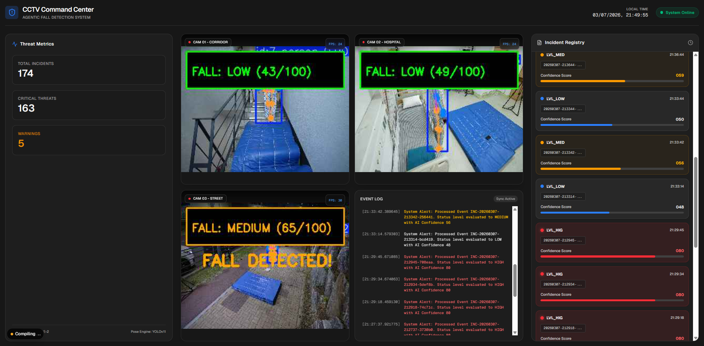

<div align="center">

# 🚨 Agentic AI 낙상 감지 시스템
### Multi-Zone Real-Time Fall Detection with Agentic Workflow

<br/>

[-6366f1?style=for-the-badge&logo=data:image/svg+xml;base64,PHN2ZyB4bWxucz0iaHR0cDovL3d3dy53My5vcmcvMjAwMC9zdmciIHZpZXdCb3g9IjAgMCAyNCAyNCI+PHBhdGggZmlsbD0id2hpdGUiIGQ9Ik0xMiAyQzYuNDggMiAyIDYuNDggMiAxMnM0LjQ4IDEwIDEwIDEwIDEwLTQuNDggMTAtMTBTMTcuNTIgMiAxMiAyek0xMSAxN3YtNkg5bDMtNCAzIDRoLTJ2NmgtMnoiLz48L3N2Zz4=)](https://github.com/yhlee/Agentic-fall-detection-system)
[](https://fastapi.tiangolo.com/)
[](https://nextjs.org/)
[](https://ultralytics.com/)
[](https://huggingface.co/microsoft/Florence-2-large)
[](https://python.org)

<br/>

> 단순한 룰 기반 탐지를 넘어, **지각(Perceive) → 분석(Analyze) → 판단(Decide) → 행동(Act)** 의 자율적 사이클로 동작하는 엔터프라이즈급 실시간 낙상 관제 시스템

</div>

---

## 📺 시스템 구동 화면

<div align="center">
  
  <br/>
  <sub><b>다중 구역(Multi-Zone) 모니터링 관제 대시보드</b><br/>복도·병실·야외 등 다중 CCTV 영상을 스크롤 없이 한눈에 파악할 수 있는 다크 그레이 테마의 통합 관제 UI</sub>
</div>

---

## 🏗️ 시스템 아키텍처

```
┌─────────────────────────────────────────────────────────────────┐
│                     LangGraph Agentic Pipeline                  │
│                                                                 │
│   📹 CCTV Feed                                                  │
│       │                                                         │
│       ▼                                                         │
│  ┌─────────────┐    ┌─────────────┐    ┌─────────────┐         │
│  │ Perception  │───▶│  Analysis   │───▶│  Decision   │         │
│  │    Node     │    │    Node     │    │    Node     │         │
│  │ (YOLO11n   │    │ (Florence-2 │    │ (Severity   │         │
│  │   Pose)    │    │    VLM)     │    │  Scoring)   │         │
│  └─────────────┘    └─────────────┘    └──────┬──────┘         │
│                                               │                 │
│                                               ▼                 │
│                                        ┌─────────────┐         │
│                                        │   Action    │         │
│                                        │    Node     │         │
│                                        │ Email/Slack │         │
│                                        │ /DB Logging │         │
│                                        └─────────────┘         │
└─────────────────────────────────────────────────────────────────┘
         │                                        │
         ▼                                        ▼
  ┌─────────────┐                        ┌─────────────┐
  │  FastAPI    │ ◀────── REST API ─────▶│  Next.js   │
  │  Backend   │   MJPEG Stream + SSE   │  Dashboard  │
  │  (8000)   │                        │   (3000)   │
  └─────────────┘                        └─────────────┘
```

---

## 📌 핵심 개발 내용 및 성과

### 1. 🤖 Agentic Workflow 설계 — LangGraph 기반 자율 판단 파이프라인

| 항목 | 내용 |
|------|------|
| **기존 방식의 한계** | `if fallen → alert()` 형태의 정적 룰 기반 로직 |
| **해결 방법** | LangGraph로 `PerceptionNode → VLMNode → DecisionNode → ActionNode` 파이프라인 구현 |
| **핵심 효과** | 장소 특성(병동/계단/거실)과 위험 요소에 따라 동적으로 **심각도(Severity) 점수** 산출 |

> 🎯 **결과:** 가짜 알람(False Positive) 대폭 감소 + 실제 위급 상황 감지 정확도 획기적 향상

---

### 2. 🎥 다중 카메라 동시 스트리밍 — FastAPI Async 아키텍처

```python
# YOLO 추론이 asyncio 이벤트 루프를 블로킹하지 않도록 처리
loop = asyncio.get_event_loop()
result = await loop.run_in_executor(executor, yolo_inference, frame)
```

| 항목 | 내용 |
|------|------|
| **문제** | 무거운 YOLO 추론이 단일 스레드 이벤트 루프를 블로킹 |
| **해결** | `run_in_executor` 기반 멀티스레딩 MJPEG 스트리밍 |
| **효과** | YOLO 추론을 별도 스레드로 분리하여 다중 카메라 동시 스트리밍 가능 |

---

### 3. 🤔 포즈 추정 휴리스틱 튜닝 — False Positive 제거

<details>
<summary><b>📐 낙상 판정 알고리즘 상세 (클릭하여 펼치기)</b></summary>

```
공통적인 문제:
  - 쪼그려 앉기(Squatting) → 낙상으로 오인 (기울기 유사)
  - 빠른 전진 동작 → 순간적으로 낙상 각도 통과

해결 로직:
  1. 신체 기울기(Angle) 임계치: 45° (기존 30° → 상향)
  2. 즉발성 알람: 완전 제거
  3. 지속 시간 조건: 0.75초(15프레임) 이상 바닥 평행 상태 유지 시에만 낙상 판정
```

</details>

> 🎯 **결과:** 일상 동작과 실제 낙상의 완벽한 구분, 견고한 탐지 정확도 확보

---

### 4. 🖥️ 관제실 특화 대시보드 — Next.js + TailwindCSS

**주요 UI 기능:**
- 🔴 낙상 감지 즉시 **화면 전체 붉은색 맥박(Pulse) 점멸**
- 🚨 **출동 요원 배치** 타이포그래피 오버레이 자동 출력
- 📊 SQLite DB와 **2초 폴링**으로 실시간 통계 갱신
- 🌑 사이버펑크 감성의 **다크 모드 전용 UI**

---

### 5. 📧 실시간 자동 긴급 이메일 발송 — 오프라인 2중 안전장치

```
낙상 감지 (HIGH Severity)
        │
        ├── 📸 해당 프레임 캡처
        ├── 📝 Florence-2 상황 분석 보고서 생성 (TXT)
        └── 📧 Gmail SMTP → 담당자 스마트폰으로 즉시 전송
              └── 첨부: 낙상 스냅샷 + 분석 보고서
```

> 🎯 **결과:** 보안 담당자가 자리를 비운 **최악의 시나리오에서도** 스마트폰으로 즉시 상황 파악 가능

<div align="center">
  <table>
    <tr>
      <td align="center">
        <br/>
        <sub><b>� 이메일함 — 다중 낙상 감지 알림</b><br/>발생할 때마다 자동으로 긴급 메일 수신</sub>
      </td>
      <td align="center">
        <br/>
        <sub><b>� 이메일 본문 — 현장 상황 요약</b><br/>Florence-2 VLM이 진단한 상황 분석 포함</sub>
      </td>
    </tr>
    <tr>
      <td align="center">
        <br/>
        <sub><b>📸 낙상 감지 스냅샷</b><br/>낙상 발생 순간 자동 캡처된 현장 사진</sub>
      </td>
      <td align="center">
        <br/>
        <sub><b>📋 자동 생성 긴급 상황 보고서</b><br/>심각도·위치·권고 조치가 담긴 TXT 보고서</sub>
      </td>
    </tr>
  </table>
</div>

---

## 🛠️ 기술 스택

| 분류 | 기술 |
|------|------|
| **AI / Agent** | LangGraph, YOLO11n-pose (Ultralytics), Florence-2 (Microsoft) |
| **Backend** | Python 3.10+, FastAPI, Uvicorn, SQLite |
| **Frontend** | Next.js (React), TailwindCSS, Lucide Icons |
| **알림** | Gmail SMTP, Slack Webhook (선택) |

---

## 📊 데이터셋

테스트에 사용된 입력 영상은 **AI Hub**의 공개 데이터셋을 활용했습니다.

| 항목 | 내용 |
|------|------|
| **데이터셋명** | 낙상사고 위험동작 영상-센서 쌍 데이터 |
| **출처** | [AI Hub](https://aihub.or.kr/) (한국지능정보사회진흥원) |
| **비고** | 입력 영상은 용량 및 라이선스 문제로 저장소에 포함되지 않습니다 |

---


## 🚀 빠른 시작 (Quick Start)

### 사전 준비 (Prerequisites)


- Python **3.10** 이상
- Node.js & npm

### ① AI 모델 다운로드

> `.pt` 모델 파일은 용량 문제로 Git에 포함되지 않습니다. 아래 명령어로 다운로드하세요.

```bash
mkdir -p models
wget -O models/yolov26n-pose.pt \
  https://github.com/ultralytics/assets/releases/download/v8.3.0/yolo11n-pose.pt
```

### ② 백엔드 실행

```bash
# 가상환경 생성 및 활성화
python3 -m venv .venv
source .venv/bin/activate  # Windows: .venv\Scripts\activate

# 의존성 설치
pip install -r requirements.txt

# FastAPI 서버 실행
.venv/bin/python3 -m uvicorn api.main:app --port 8000 --reload
```

### ② 프론트엔드 실행

```bash
# 새 터미널에서 실행
cd frontend
npm install
npm run dev
```

### ③ 접속

브라우저에서 **[http://localhost:3000](http://localhost:3000)** 접속 → 다중 구역 낙상 관제 대시보드 확인 ✅

---

## 📁 프로젝트 구조

```
Agentic-fall-detection-system/
├── agentic/                  # LangGraph 에이전트 핵심 로직
│   ├── graph.py              # 워크플로우 그래프 정의
│   ├── state.py              # 에이전트 상태 스키마
│   ├── nodes/
│   │   ├── perception.py     # YOLO11n 포즈 추정 노드
│   │   ├── analysis.py       # Florence-2 VLM 분석 노드
│   │   ├── decision.py       # 심각도 판단 노드
│   │   └── action.py         # 이메일/DB/Slack 액션 노드
│   └── tools/                # 보조 도구 모음
├── api/
│   └── main.py               # FastAPI 라우터 & MJPEG 스트리밍
├── frontend/                 # Next.js 대시보드
├── figures/                  # 스크린샷 및 구동 화면
├── main_agentic.py           # 메인 실행 진입점
└── requirements.txt
```

---

<div align="center">

**Made for safety monitoring 👀**

</div>
