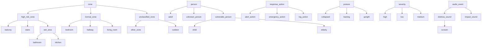

# 온톨로지 · 지식그래프 · Prolog 기반 설명가능 판정

전체 개요는 [README](../README.md), 2-Track 설계 근거는 [ARCHITECTURE.md](ARCHITECTURE.md)를 참고.

---


기존 판정은 0~100 점수만 반환해 "왜 그 판정인가"에 답하지 못했다.
온톨로지 모드는 RDF/OWL 개념 계층과 Prolog 규칙 16개로 판정하고,
발동한 규칙을 근거로 함께 반환한다.

## 착수 계기 — 기존 판정 로직에서 확인한 결함 3가지

이 작업은 새 기능을 얹으려고 시작한 것이 아니라, 기존 판정 경로를 실행해
보다가 발견한 문제에서 출발했다. 셋 다 현재 코드에 그대로 남아 있다
(`decision.py`는 비교 대조군이므로 의도적으로 고치지 않았다).

**① 판정에 난수가 섞여 있다** — `decision.py:91`

```python
base_score = 40 + angle_bonus + vel_bonus + random.randint(-5, 5)
```

임계값 부근에서 동일 입력의 판정이 갈린다. 아래 비교표 S6·S7의 `rule` 열이
그 결과다. MEDIUM은 `save_snapshot` + `notify_security_room`을 유발하므로,
같은 상황에서 경비실 통보 여부가 실행마다 달라진다.

**② 무동작 지속 시간이 계산에 쓰이지 않는다** — `decision.py:78`

`no_movement_seconds`를 읽지만 이후 점수식에 등장하지 않는다. 함수 전체에서
할당문 1회만 나타난다. 그 결과 아래 표의 S1(8초)과 S5(300초)가 같은 판정을
받는다. 낙상 감지에서 가장 중요한 변수가 무시되고 있었다.

**③ LLM 경로가 폴백만 타고 있었다** — `decision_llm.py:53`

`OLLAMA_MODEL`이 설치되지 않은 `llama3.2`를 가리켜, 호출 시 예외가 나고
`except`가 조용히 룰 기반으로 되돌렸다. 실제로는 LLM이 한 번도 돌지 않은
상태였다. `qwen2.5:7b`로 교체해 살린 뒤 측정한 결과가 아래 표의 `llm` 열이다.

이 셋은 모두 **"판정 근거를 추적할 수 없다"**는 하나의 문제로 모인다.
점수만 반환하는 구조에서는 잘못된 값이 나와도 어디서 비롯됐는지 알 수 없다.
그래서 판정을 점수 계산이 아니라 규칙 추론으로 재구성했다.

## 구성

```
agentic/ontology/
    ontology.ttl              # RDF/OWL 정본 — 개념 38개 + 관계 9개
    schema.py                 # ttl → Prolog is_a/2 변환, 순환 검증
    generated/
        ontology_facts.pl     # schema.py 생성물 (커밋 대상)
    facts.py                  # AgentState → Prolog 사실 (순수 함수, 난수 없음)
    history.py                # incidents DB → prior_incident/3 시간축 사실
    rules.pl                  # 판정 규칙 16개 + 파생 술어
    engine.py                 # pyswip 엔진, 전역 Lock, 판정마다 사실 격리
    visualize.py              # ttl → Mermaid 다이어그램

agentic/nodes/decision_ontology.py   # 4번째 판정 모드
scripts/compare_modes.py             # 4개 모드 비교 → 아래 표 생성
```

설계상 지킨 원칙은 네 가지다.

| 원칙 | 구현 |
|---|---|
| 계층은 한 곳에만 기록 | `ontology.ttl`이 정본, `is_a/2`는 생성물. `rules.pl`에 계층 사실 0건 |
| 판정에 난수 없음 | `facts.py`는 순수 함수, 동일 입력 → 동일 사실 목록 |
| 판정 간 상태 누출 없음 | `engine.judge()`가 매 판정마다 동적 술어를 `retractall` |
| 점수를 새로 만들지 않음 | `severity_score`는 고정 매핑(LOW 25 / MEDIUM 60 / HIGH 90), 판정에 미관여 |

## 판정 규칙 16개

규칙은 상위 개념만 참조한다. 그래서 `Balcony` 같은 구체 개념을 추가해도
`ontology.ttl`에 한 줄 넣으면 규칙 수정 없이 곧바로 적용된다.

| | 조건 | 판정 |
|---|---|---|
| r1 | 고위험 구역 + 무동작 ≥ 30초 | HIGH |
| r2 | 취약 계층(노인·아동) + 비명 | HIGH |
| r3 | 무동작 ≥ 60초 | HIGH |
| r4 | 붕괴 자세 + 충격음 + 무동작 ≥ 20초 | HIGH |
| r5 | 취약 계층 + 고위험 구역 + 무동작 ≥ 15초 | HIGH |
| r6 | 동일 구역 재낙상(5분~3일) + 무동작 ≥ 10초 | HIGH |
| r7 | 고위험 구역 + 무동작 10~30초 | MEDIUM |
| r8 | 비명 감지 | MEDIUM |
| r9 | 취약 계층 + 무동작 ≥ 15초 | MEDIUM |
| r10 | 붕괴 자세 + 무동작 ≥ 10초 | MEDIUM |
| r11 | 충격음 + 붕괴 자세 | MEDIUM |
| r12 | 주변 위험물 + 붕괴 자세 | MEDIUM |
| r13 | 동일 구역 재낙상(5분~3일) | MEDIUM |
| r14~16 | 심각도 → 대응 액션 매핑 | — |

발동한 규칙이 하나도 없으면 LOW다. `r6`·`r13`은 **기존 세 경로가 구조적으로
수행할 수 없는 판정**이다. 프레임 하나만 보고 판단하는 구조에는 이력이라는
개념 자체가 없다.

`r6`·`r13`의 5분 하한은 자기증폭을 막기 위한 것이다. `ActionNode`가 LOW를
포함한 모든 판정을 DB에 기록하고 `PerceptionNode`가 같은 낙상의 재검출을
허용하므로(`COOLDOWN_FRAMES=60`, 30fps 기준 약 2초), 하한이 없으면 사건 1건이
몇 초 전의 자기 자신을 재낙상 근거로 삼아 스스로를 HIGH로 올린다. 값은
`rules.pl`의 `repeat_fall_min_minutes/1`에 있고, 근거와 대가(5분 내 실제 2차
낙상은 시간축 가중치를 못 받는다)를 같은 파일 주석에 적어 두었다.

## Prolog 연동에서 부딪힌 것

**① 개념 계층 추론은 두 줄이다**

```prolog
kind_of(X, Y) :- is_a(X, Y).
kind_of(X, Y) :- is_a(X, Z), kind_of(Z, Y).
```

이 재귀가 `bathroom → wet_area → high_risk_zone`을 자동으로 잇는다. 규칙은
상위 개념(`high_risk_zone`, `vulnerable_person`)만 참조하므로, `Balcony` 같은
구체 개념을 추가해도 `ontology.ttl`에 한 줄이면 되고 `rules.pl`은 손대지 않는다.

**② SWI-Prolog 엔진은 프로세스당 하나여서 멀티스레드에서 깨진다**

`api/main.py`는 `VideoStream`마다 추론 스레드를 띄우므로 카메라 4대면 판정
노드가 동시 호출된다. 실측 결과는 이렇다.

| | 질의 지연 | 스레드 4개 × 50회 |
|---|---|---|
| pyswip 단독 | 0.021 ms | **200회 중 50회만 성공** (`NestedQueryError`) |
| pyswip + 전역 Lock | 0.021 ms | 200 / 200 성공 |
| subprocess | 6.29 ms | 안전하지만 300배 느림 |

`pyswip`의 `Prolog`는 이 버전에서 클래스 레벨 API(`_queryIsOpen`이 클래스 속성)라
인스턴스별 락으로는 부족하다. 모듈 전역 Lock으로 모든 질의를 직렬화했고,
오버헤드는 측정되지 않는 수준이다. SWI 공식 인터페이스인 `janus`는 설치된
9.0.4에 포함돼 있지 않아 제외했다.

**③ 엔진이 장기 실행되므로 판정 간 사실이 샌다**

이전 사건의 사실이 남으면 다음 판정이 오염된다. `judge()`가 매 호출마다
동적 술어 7종을 `retractall`로 비우고 새로 주입한다.

```python
with _QUERY_LOCK:
    self._retract_all()        # 이전 사건 흔적 제거
    for fact in facts:
        self._pl.assertz(fact)
    ...
```

이로써 판정이 **입력 사실만의 함수**가 된다. 이 불변식은 테스트로 고정돼 있어,
`_retract_all`을 제거하면 즉시 깨진다.

**④ 발동 규칙 회수**

```prolog
fired(I, R, Sev) :- rule(R, Sev, I).
```

`fired(current, R, Sev), rule_text(R, D)` 한 번의 질의로 발동한 규칙 ID와
한국어 설명을 함께 받는다. 이것이 아래 "발동 규칙" 목록의 출처이며,
`severity/2`는 컷(`!`)으로 HIGH → MEDIUM → LOW 우선순위를 해소한다.

## 2-Track 아키텍처와의 연결

기존 2-Track 구조(실시간 규칙 → 비동기 LLM Agent)는 그대로 두고, Track 1의
Decision 노드에 판정 경로 하나를 더한 형태다.

```
[Track 1 — 실시간]
Perception → Audio → Analysis → Decision ─────→ Action
                                   │               │
                    ┌──────────────┼──────┐        └──→ [Track 2 — 비동기]
                    │              │      │              EscalationAgent
              rule/attention      llm  ontology           (119 신고 여부 판단)
                 (점수)         (점수)  (규칙 ID)                ▲
                                        │                        │
                        ontology.ttl ───┤     발동 규칙 목록 ─────┘
                        rules.pl ───────┤
                        incidents.db ───┘
```

Track 1이 확정한 발동 규칙을 Track 2가 입력으로 받는다. 이전에는 점수만
넘어가서, Track 2의 LLM이 "왜 HIGH인가"를 스스로 되짚어야 했다.

```
[이전]  - Current severity: HIGH (score: 90)

[지금]  - Current severity: HIGH (score: 90)
        - Fired rules (symbolic reasoning): r1 (고위험 구역에서 30초 이상 무동작),
          r5 (취약 계층 + 고위험 구역 + 무동작 15초 이상), ...
```

특히 `r6`(재낙상)가 걸린 경우, Track 1이 이미 이력을 조회해 판정에 반영했으므로
Track 2는 `query_incident_history` 도구를 호출할 필요가 없다. 제한된 ReAct 반복
횟수(기본 4회)를 외부 신고 판단 같은 더 어려운 문제에 쓸 수 있다.

**기호적 추론(Track 1)의 결과가 생성형 판단(Track 2)의 입력이 되는 구조다.**
규칙이 "무엇이 걸렸는가"를 결정론적으로 확정하고, LLM이 "그래서 어떻게 할
것인가"를 맡는다. 온톨로지 모드가 아닐 때 `fired_rules`는 빈 목록이며,
그 경우 프롬프트에 해당 줄이 들어가지 않는다.

## 개념 계층



## 판정 방식 비교

| | rule | attention | llm | ontology |
|---|---|---|---|---|
| 재현성 | 난수로 흔들림 | 있음 | 없음 | 있음 (조건부) |
| 무동작 시간 반영 | 없음 | 있음 | 있음 | 있음 |
| 취약 계층 구분 | 노인만 | 노인만 | 프롬프트 의존 | 노인 + 아동 |
| 시간축(재낙상) 판정 | 불가 | 불가 | 불가 | 가능 |
| 판단 근거 | 없음 | 모달리티 가중치 | 자연어 | 발동 규칙 ID |
| 새 구역 추가 | 코드 수정 | 재학습 | 프롬프트 수정 | `is_a` 한 줄 |

> `ontology` 열의 재현성은 조건부입니다. 판정은 입력 사실**과** 저장된 사건 이력 양쪽의
> 함수이므로, 같은 입력이라도 DB 이력이 다르면 판정이 달라질 수 있습니다(아래 S8이 그 예입니다).
> 또한 Prolog 엔진 적재에 실패하면 `ontology_fallback` 경로가 `decision_node_rule`을 재사용하므로
> 그 경우에는 `rule` 열과 같은 난수 지터가 그대로 나타납니다.

> `attention` 모드는 사람이 직접 라벨링한 데이터가 아니라 `agentic/fusion/dataset.py`의
> 규칙 기반 합성 데이터로 학습됐다. 따라서 이 표에서 `attention` 열을 정답(ground truth)
> 취급해서는 안 되며, 다른 모드와 동일하게 하나의 판정 방식으로 비교 대상일 뿐이다.

> 아래 표는 `python -m scripts.compare_modes` 가 임시 DB 를 직접 만들어 S8 용 이력 1건
> (카메라 99, 24시간 전)만 주입한 상태에서 생성했습니다. 프로젝트 루트의 `incidents.db` 는
> 읽지도 쓰지도 않으므로, 같은 코드로 재실행하면 ontology 열은 같은 값이 나옵니다.

> LLM 열은 호출 비용이 커서 3회만 반복했습니다. 다른 열(30회)과 반복 횟수가 다르므로 동일한 표본 수로 비교하지 마십시오.

| 시나리오 | 상황 | rule | attention | llm | ontology |
|---|---|---|---|---|---|
| S1 | 거실, 8초, 성인 | MEDIUM | HIGH | MEDIUM | LOW (점수 없음) |
| S2 | 화장실, 45초, 노인 | HIGH | HIGH | MEDIUM | HIGH (점수 없음) |
| S3 | 복도, 12초, 성인, 비명 | HIGH | HIGH | MEDIUM | MEDIUM (점수 없음) |
| S4 | 계단, 35초, 성인 | **HIGH/MEDIUM** (비결정적) | HIGH | MEDIUM | HIGH (점수 없음) |
| S5 | 거실, 300초, 성인 | MEDIUM | HIGH | MEDIUM | HIGH (점수 없음) |
| S6 | 화장실, 20초, 아동 | **HIGH/MEDIUM** (비결정적) | HIGH | MEDIUM | HIGH (점수 없음) |
| S7 | 경계값 (각도 46, 속도 12, 0초) | **LOW/MEDIUM** (비결정적) | LOW | MEDIUM | LOW (점수 없음) |
| S8 | 복도, 12초 + 3일 내 재낙상 | MEDIUM | HIGH | MEDIUM | HIGH (점수 없음) |
| S9 | 붕괴자세 + 충격음 + 25초 | HIGH | HIGH | MEDIUM | HIGH (점수 없음) |
| S10 | 위험물 + 붕괴자세 | HIGH | MEDIUM | MEDIUM | MEDIUM (점수 없음) |

LLM 모드는 10개 시나리오에 대해 총 30회 호출(시나리오당 3회)됐고, **30회 전부 MEDIUM**을 반환했습니다.
자체 점수도 좁게 뭉쳤습니다 — `scripts/compare_modes.py` 가 표 아래에 함께 출력하는 분포는
`LLM 자체 점수 분포 (총 30회 호출): 65점 29회, 73점 1회` 였습니다. 즉 이 표의 `llm` 열은
"다른 모드와 판정이 엇갈린다"가 아니라 "입력과 무관하게 같은 답을 낸다"로 읽어야 합니다.

`rule` 열의 비결정성(S4, S6, S7)은 `agentic/nodes/decision.py:91`의 `random.randint(-5, 5)`
지터가 원인이며, S1과 S5가 같은 판정을 받는 것은 같은 파일 78번 줄에서 읽어들인
`no_movement_seconds`가 이후 어디에도 쓰이지 않기 때문이다. 둘 다 버그이지만
룰 기반 경로(`decision.py`)를 대조군으로 그대로 남겨두기 위해 의도적으로 고치지 않았다.

이 실험은 "온톨로지 모드가 더 정확하다"를 보여주지 않는다. 프로젝트 안에 라벨링된
낙상 정답 데이터셋이 없어 정확도 자체를 측정할 방법이 없기 때문이다. 대신 확인된 것은
① 재현성(난수 없이, 같은 입력 사실과 같은 이력이면 같은 판정), ② 무동작 지속 시간을 실제로 판정에
반영함, ③ 노인·아동을 함께 취약 계층으로 다룸, ④ 3일 내 재낙상 같은 시간축 정보를
판정에 사용함(S8), ⑤ 판정 근거를 발동 규칙 ID로 제시할 수 있음(아래 목록) — 이 다섯 가지다.

### 발동 규칙 (ontology 모드)

- **S1** 거실, 8초, 성인 → **LOW** — 없음
- **S2** 화장실, 45초, 노인 → **HIGH** — `r1` 고위험 구역에서 30초 이상 무동작, `r5` 취약 계층 + 고위험 구역 + 무동작 15초 이상, `r9` 취약 계층 + 무동작 15초 이상, `r10` 붕괴 자세 + 무동작 10초 이상
- **S3** 복도, 12초, 성인, 비명 → **MEDIUM** — `r8` 비명 감지, `r10` 붕괴 자세 + 무동작 10초 이상
- **S4** 계단, 35초, 성인 → **HIGH** — `r1` 고위험 구역에서 30초 이상 무동작, `r10` 붕괴 자세 + 무동작 10초 이상
- **S5** 거실, 300초, 성인 → **HIGH** — `r3` 무동작 60초 이상, `r10` 붕괴 자세 + 무동작 10초 이상
- **S6** 화장실, 20초, 아동 → **HIGH** — `r5` 취약 계층 + 고위험 구역 + 무동작 15초 이상, `r7` 고위험 구역에서 10~30초 무동작, `r9` 취약 계층 + 무동작 15초 이상, `r10` 붕괴 자세 + 무동작 10초 이상
- **S7** 경계값 (각도 46, 속도 12, 0초) → **LOW** — 없음
- **S8** 복도, 12초 + 3일 내 재낙상 → **HIGH** — `r6` 3일 내 동일 구역 재낙상(5분 이상 경과) + 무동작 10초 이상, `r10` 붕괴 자세 + 무동작 10초 이상, `r13` 3일 내 동일 구역 재낙상(5분 이상 경과)
- **S9** 붕괴자세 + 충격음 + 25초 → **HIGH** — `r4` 붕괴 자세 + 충격음 + 무동작 20초 이상, `r10` 붕괴 자세 + 무동작 10초 이상, `r11` 충격음 + 붕괴 자세
- **S10** 위험물 + 붕괴자세 → **MEDIUM** — `r12` 주변 위험물 + 붕괴 자세

## 실행

```bash
# SWI-Prolog 설치 (최초 1회)
sudo apt-get install -y swi-prolog-nox
pip install pyswip rdflib

# 온톨로지 → Prolog 사실 재생성 (ontology.ttl 수정 시)
python -m agentic.ontology.schema

# 4개 모드 비교 실험 (임시 DB 를 스스로 만들어 쓰므로 incidents.db 를 건드리지 않는다)
python -m scripts.compare_modes

# 영상 처리에 온톨로지 모드 적용
python main_agentic.py --video input/sample.mp4 --skip-vlm --skip-audio --decision-mode ontology
```

---
